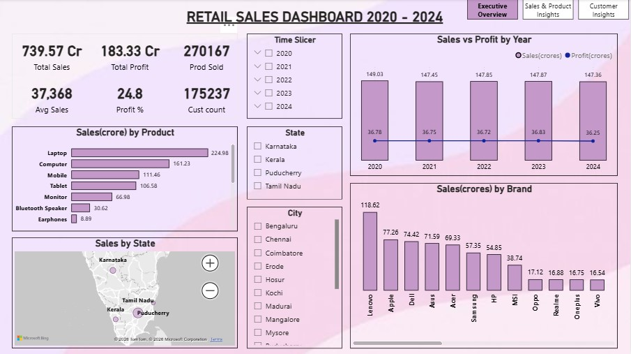

# 📊 Retail Sales Analytics – End-to-End Data Analysis Project

An end-to-end retail sales analytics project built using **Python, SQL, and Power BI** to transform messy retail data into meaningful business insights.

This project demonstrates a complete analytics workflow:

> **Raw Data → Data Cleaning → SQL Analysis → KPI Generation → Interactive Dashboard**

---

## 🚀 Project Overview

The objective of this project is to analyze retail sales performance by cleaning real-world unstructured retail data, generating business KPIs, and building an interactive dashboard for business decision-making.

The workflow includes:

- Cleaning messy retail sales data using Python  
- Performing business analysis using SQL  
- Building KPI-driven dashboards in Power BI  
- Extracting insights related to sales, customers, products, profit, and geography  

---

## 🛠️ Tech Stack

### Technologies Used

- **Python** → Data Cleaning & Feature Engineering  
- **MySQL (SQL)** → KPI Analysis & Business Queries  
- **Power BI** → Dashboarding & Visualization  

### Python Libraries

```txt
pandas
numpy
rapidfuzz
word2number
```

---

## 📂 Project Structure

```txt
Retail-Sales-Analytics/
│── Data/
│   ├── Retail sales data - Cleaned.csv
│   ├── Retail sales data - Uncleaned.csv
│
│── Images/
│   ├── page 1.png
│   ├── page 2.png
│   ├── page 3.png
│
│── Power BI/
│   ├── Retail sales data - Dashboard.pbix
│
│── Python/
│   ├── Retail sales data - Cleaned.py
│
│── SQL/
│   ├── Retail sales data - Analyze.sql
│
│── README.md
```

---

## 🧾 Dataset Description

The dataset contains retail transaction-level information related to customer purchases, products, pricing, and geography.

### Dataset Columns

- Date  
- Transaction ID  
- Customer ID  
- Customer Phone Number  
- Customer Age  
- Customer Gender  
- Transaction Method  
- Product Category  
- Brand Name  
- City  
- State  
- Quantity  
- Unit Price  
- Cost  
- Review After 2 Months  

### Real-World Data Issues Handled

The raw dataset contained multiple inconsistencies and quality issues:

- Missing values  
- Duplicate records  
- Incorrect date formats  
- Inconsistent naming conventions  
- Invalid phone numbers and age values  
- Outliers in cost and price columns  
- Incorrect brand-category mappings  
- Text inconsistencies in product, city, and brand names  

---

## 🧹 Data Cleaning & Preparation (Python)

Data cleaning and preprocessing were performed using:

```txt
Python/Retail sales data - Cleaned.py
```

### Key Data Cleaning Tasks

✔ Removed duplicate rows  

✔ Standardized date formats  

✔ Cleaned and standardized:
- Transaction ID  
- Customer ID  
- Customer Phone Number  
- Customer Age  

✔ Standardized:
- Gender values  
- Transaction methods  

✔ Applied fuzzy matching using **RapidFuzz** for:

- Product Category  
- Brand Name  
- City Name  

✔ Removed invalid brand-category combinations  

✔ Handled outliers using:

- IQR Method  
- Category-level business ranges  

✔ Treated missing values using:

- Median imputation  
- Mode imputation  

---

### Feature Engineering

Additional business features created:

```txt
total_price = quantity × unit_price
profit = total_price − (quantity × cost)
branch_id
sales_rep
```

Final cleaned dataset exported to:

```txt
Data/Retail sales data - Cleaned.csv
```

---

## 🗄️ SQL Analytics & KPI Development

SQL analysis was performed using:

```txt
SQL/Retail sales data - Analyze.sql
```

### Business Analysis Performed

- Overall KPI generation  
- Yearly sales & profit analysis  
- Monthly sales trends  
- Quarterly performance analysis  
- Product category analysis  
- Brand-wise performance analysis  
- State & city sales analysis  
- Sales representative performance  
- Gender-wise and age-group customer analysis  
- Customer Lifetime Value (CLV) analysis  
- Repeated customer analysis  
- Product and brand rating analysis  

---

### SQL Concepts Used

✔ Views  

✔ Stored Procedures  

✔ SQL Functions  

✔ Aggregations & Grouping  

✔ Customer Segmentation  

✔ KPI Analysis  

---

### Stored Procedures

**Top 5 Analysis**

```sql
CALL top5('brand_name');
CALL top5('product_category');
```

**Bottom 5 Analysis**

```sql
CALL bottom5('brand_name');
CALL bottom5('sales_rep');
```

---

### SQL Functions

Custom functions created for:

- **AOV (Average Order Value)**  
- **Profit Margin Calculation**

---

## 📊 Power BI Dashboard

Interactive dashboard built using **Power BI** for retail sales monitoring and business intelligence.

### Dashboard Pages

### 1. Executive Overview

Includes:

- KPI Cards  
- Sales vs Profit Trends  
- Product Performance  
- Brand Performance  
- State & City Analysis  
- Interactive Slicers  

### 2. Sales & Product Insights

Includes:

- Product Sales Analysis  
- Brand-wise Performance  
- Profitability Analysis  
- Sales Representative Analysis  
- Branch Performance  

### 3. Customer Insights

Includes:

- Customer Demographics  
- Transaction Method Analysis  
- Repeat Customer Tracking  
- Customer Ratings Analysis  
- Top Customer Analysis  

---

## 📷 Dashboard Screenshots

### Executive Overview



### Sales & Product Insights


### Customer Insights


---

## 📈 Key Business Insights

- Identified top-performing products and brands  
- Analyzed yearly sales and profitability trends  
- Measured regional performance by city and state  
- Evaluated customer demographics and purchase behavior  
- Identified repeat customers and customer lifetime value trends  
- Compared sales contribution across categories and brands  

---

## 📚 Skills Demonstrated

### Python

- Data Cleaning  
- Data Validation  
- Fuzzy Matching  
- Outlier Detection  
- Feature Engineering  

### SQL

- Views & Stored Procedures  
- KPI Development  
- Aggregation & Segmentation  
- Business Analytics Queries  

### Power BI

- Dashboard Design  
- Interactive Reporting  
- KPI Visualization  
- Business Storytelling  

---

## ▶️ How to Run the Project

### 1. Run Python Data Cleaning

```bash
cd Python
python "Retail sales data - Cleaned.py"
```

---

### 2. Run SQL Analysis

1. Open **MySQL Workbench**  
2. Copy cleaned CSV to:

```txt
C:\ProgramData\MySQL\MySQL Server 8.0\Uploads\
```

3. Run:

```txt
SQL/Retail sales data - Analyze.sql
```

---

### 3. Open Power BI Dashboard

Open:

```txt
Power BI/Retail sales data - Dashboard.pbix
```

---

## 🎯 Learning Outcomes

Through this project, I strengthened practical skills in:

- Real-world messy data cleaning  
- SQL business analytics  
- KPI generation & reporting  
- Interactive dashboard building  
- End-to-end analytics workflow  
- Business insight extraction from raw retail data  

---

## ⭐ If you found this project useful, consider giving it a star!